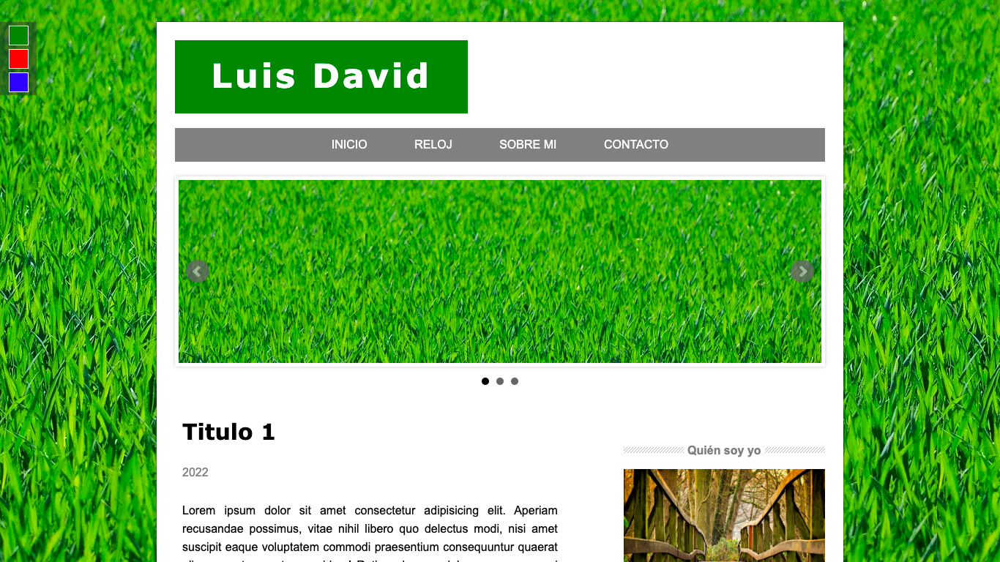

# JavaScript Page

## Table of contents

- [Overview](#overview)
  - [The challenge](#the-challenge)
  - [Screenshot](#screenshot)
- [My process](#my-process)
  - [Built with](#built-with)
  - [What I learned](#what-i-learned)
  - [Continued development](#continued-development)
- [Author](#author)

## Overview

### The challenge

Users should be able to:

- View the page from any device
- View a Home page with a main slider
- To be able to register through the login
- Being able to log out of the registry
- See a real-time clock
- See a fake contact form

### Screenshot

## My process

### Built with

- HTML
- CSS
- JavaScript
- jQuery library

### What I learned

In this project I learned to implement the jQuery library to perform some javascript actions, such as placing different items by implementing a date with Date(), in addition to implementing the option to change the theme, which changes the background image and the primary colors.
Also implement registration or login using localStorage so that the page can recognize who is visiting the page.

### Continued development

Carry out an implementation of real articles and make a more attractive javascript clock design, in addition to incorporating the contact form so that it actually sends the information.

## Author

Luis David Jimenez Martinez
- Portfolio - [www.luisdavidjm.com](https://www.luisdavidjm.com)
- GitHub - [LuisDavidJM](https://github.com/LuisDavidJM)
